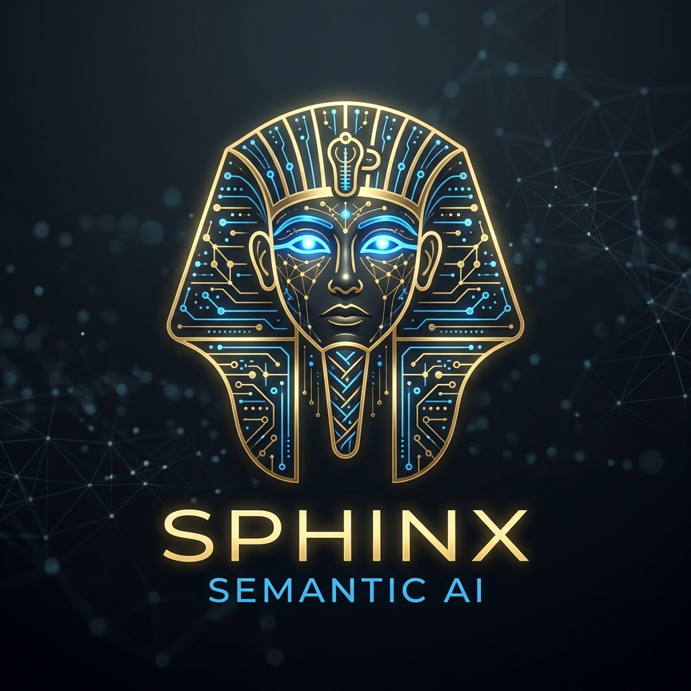
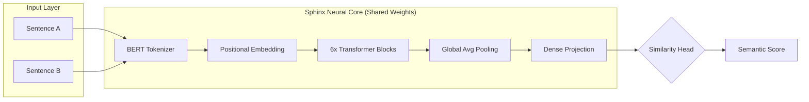

# 🏺 Sphinx Semantic AI: Neural Intelligence Engine

<div align="center">
  
  <br>
  <h1>Sphinx Semantic AI</h1>
  <p><i>The Apex of Semantic Intelligence and Neural Textual Understanding</i></p>
  
  <p>
    
    
    
    
  </p>
</div>

---

## 🌌 Executive Overview

**Sphinx Semantic AI** is a state-of-the-art NLP framework engineered for deep semantic analysis and real-time model evolution. Moving beyond traditional lexical matching, Sphinx implements a high-performance **Siamese Transformer** that project sentences into a normalized 256-dimensional latent space. 

By measuring the angular distance between these neural embeddings, Sphinx achieves human-level accuracy in Semantic Textual Similarity (STS) tasks, powered by a "Never Forgets" replay-memory pipeline.

## 🏗️ Mathematical Foundation

### Contrastive Representation Learning
Sphinx is trained using a calibrated **Contrastive Loss** function, which optimizes the distance between sentence pairs in the vector space.

$$L(y, d) = y \cdot d^2 + (1 - y) \cdot \max(margin - d, 0)^2$$

Where:
- $y$: Ground truth similarity label $[0, 1]$
- $d$: Euclidean distance between embeddings $||E(s_1) - E(s_2)||_2$
- $margin$: Hyperparameter set to $0.5$ to prevent collapse of dissimilar pairs.

### Semantic Similarity Metric
The similarity score $S$ is calculated using the dot product of normalized embeddings, equivalent to **Cosine Similarity**:

$$S(s_1, s_2) = \frac{E(s_1) \cdot E(s_2)}{\|E(s_1)\| \|E(s_2)\|}$$

## 📐 Technical Architecture

### Neural Pipeline
Sphinx leverages a shared-weight dual-encoder topology based on the Transformer architecture.



### Hyperparameters
| Component | Specification | Details |
| :--- | :--- | :--- |
| **Model Depth** | 6 Layers | Multi-head attention blocks |
| **Model Dimension** | 256 | Internal vector representation size |
| **Attention Heads** | 4 | Parallel context processing paths |
| **Max Sequence** | 128 | Token limit per sentence |
| **Parameter Count** | 12.65 Million | Full trainable neural network weights |
| **Tokenizer** | WordPiece | BERT-base-uncased vocabulary (30k+) |

## 🧠 Advanced Features

### 🔄 "Never Forgets" Replay Engine
Sphinx solves the problem of **Catastrophic Forgetting** in real-time training. 
> [!IMPORTANT]
> When a user submits a new training pair, the engine doesn't just train on the new sample. It triggers a **Global Replay Session** which retrains the model on the *entire historical dataset* persisted in `training_data.jsonl`, ensuring stable intelligence evolution.

### 🧪 Production Dashboard
- **Live Telemetry**: Real-time monitoring of loss metrics and parameter distribution.
- **Glassmorphic UI**: 3D-tilt interactions and mouse-parallax depth for a world-class user experience.
- **Async Processing**: Retraining handled via FastAPI background tasks to maintain 0ms latency for inference.

## 🚀 Deployment Guide

### Environment Setup
```bash
python3 -m venv venv
source venv/bin/activate
pip install -r requirements.txt
```

### Serving the Engine
```bash
# Start the production server
python3 app.py
```
Access the neural control center at **http://localhost:8001**.

---

## 🗺️ Roadmap
- [ ] **Sphinx V2**: Transition to 12-layer architecture.
- [ ] **Multi-lingual Support**: Integration of multilingual BERT tokenizers.
- [ ] **Vector Search**: Native integration with Milvus or Weaviate for million-scale search.

---
<div align="center">
  <sub>Developed by Alouakhalid | Sphinx Semantic AI v1.0.0</sub>
</div>
