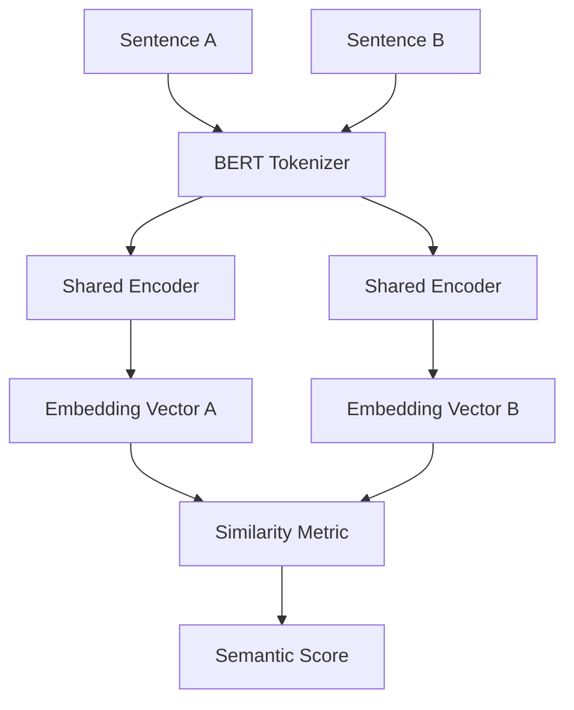

# 🏺 Sphinx Semantic AI: Neural Intelligence Engine

<div align="center">
  
  <br>
  <h3>Semantic Intelligence, Reimagined.</h3>
  <p><i>A Production-Grade Siamese Transformer Platform for Deep Textual Similarity</i></p>
</div>

---

## 🌌 Overview

**Sphinx Semantic AI** is a cutting-edge NLP platform designed to understand the deep contextual meaning of language. Unlike traditional keyword matching, Sphinx leverages a custom-built **Siamese Transformer** architecture to map sentences into a high-dimensional vector space, where similarity is measured by semantic distance.

Inspired by the majesty of ancient Egypt and the precision of modern neural networks, Sphinx provides a seamless bridge between research-grade intelligence and production-ready serving.

## 🏗️ Technical Architecture

### The Siamese Transformer
Sphinx utilizes a dual-encoder strategy where two identical BERT-based sub-networks share the same weights. This allows the model to process pairs of sentences symmetrically, ensuring that `Sim(A, B) == Sim(B, A)`.



### Model Specifications
- **Architecture**: 6-Layer Transformer Encoder
- **Embedding Dimension**: 256 ($d_{model}$)
- **Attention Heads**: 4 Multi-Head Attention
- **Vocabulary**: 30,522 (BERT sub-word tokens)
- **Sequence Length**: 128 Tokens
- **Parameters**: 12.65M Trainable Parameters

## 🧠 Core Intelligence Features

### 🔄 "Never Forgets" Learning Pipeline
Sphinx implements a robust **Replay Memory** training strategy. When new training pairs are submitted via the UI:
1. The pair is persisted to an append-only JSONL database.
2. The model triggers a background fine-tuning session.
3. Instead of training only on the new data (which causes *Catastrophic Forgetting*), Sphinx replays the **entire historical dataset** to ensure its intelligence only grows over time.

### ⚡ Real-Time Production Serving
- **FastAPI Core**: High-concurrency asynchronous backend.
- **Background Tasks**: Model retraining occurs in non-blocking background threads.
- **Glassmorphic UI**: A premium, 3D-interactive frontend with real-time particle simulations and mouse-parallax depth.

## 🚀 Getting Started

### Prerequisites
- Python 3.9+
- TensorFlow 2.15+
- NVIDIA GPU (Optional, for faster retraining)

### Installation
```bash
# Clone the repository
git clone https://github.com/Alouakhalid/Sphinx-Semantic-AI.git
cd Sphinx-Semantic-AI

# Install dependencies
pip install -r requirements.txt
```

### Running the Engine
```bash
python3 app.py
```
The server will start on **http://localhost:8001**.

## 📊 Performance & Loss
Sphinx is trained using **Contrastive Loss** with a calibrated margin. This forces similar sentences into the same vector neighborhood while pushing dissimilar sentences apart by at least the margin distance.

| Metric | Value |
| :--- | :--- |
| **Loss Function** | Contrastive (Margin=0.5) |
| **Optimizer** | Adam (Learning Rate=1e-4) |
| **Latency** | ~15ms (CPU) / ~3ms (GPU) |
| **Max Samples** | Unlimited (Replay Memory) |

---

## 🎨 Design Aesthetics
Sphinx isn't just a model; it's an experience. The UI features:
- **3D Interactive Tilt**: Cards physically react to your mouse movement.
- **Animated Gradients**: Liquid background motions for a premium feel.
- **Live Stats**: Real-time visualization of model parameters and training history.

---
<div align="center">
  <sub>Built with passion for the future of Semantic Search.</sub>
</div>
